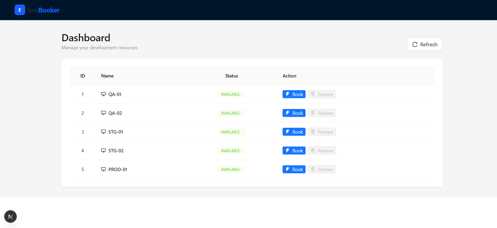

# Env Booker (MVP) - Python/Django リファクタリング版

開発チーム内での「テスト環境の占有・競合」問題を解決するために設計された、MVP（実用最小限の製品）フルスタックアプリケーションです。旧バージョンの Go (Gin) から Python (Django) へのバックエンドリファクタリングが完了しており、API の互換性は完全に維持されています。

## 🖼️ イメージ


## 🚀 技術スタック (Tech Stack)

### フロントエンド (Frontend)

* **フレームワーク**: [Next.js 16](https://nextjs.org/) (App Router)
* **UI コンポーネント**: [Ant Design (v6)](https://ant.design/)
* **スタイリング**: [Tailwind CSS](https://tailwindcss.com/)
* **E2E テスト**: [Playwright](https://playwright.dev/)

### バックエンド (Backend)

* **言語**: Python 3.12+
* **Web フレームワーク**: [Django 6.0](https://www.djangoproject.com/) + [Django REST Framework (DRF)](https://www.django-rest-framework.org/)
* **データベース**: SQLite (論理削除/Soft Delete 対応)
* **静的解析**: Pylance (DRF のメタプログラミングに最適化済み)

---

## 📂 プロジェクト構成 (Project Structure)

```text
.
├── client/                 # Next.js フロントエンドアプリケーション
│   ├── e2e/                # Playwright 期待動作確認テスト (POM パターン採用)
│   └── src/                # ソースコード (App Router, Types)
├── server/                 # Django バックエンドアプリケーション
│   ├── backend/            # プロジェクト設定 (settings, urls)
│   ├── envs/               # 業務ロジック (Models, Views, Serializers)
│   │   └── migrations/     # データベースマイグレーション履歴
│   ├── manage.py           # Django 管理用スクリプト
│   ├── requirements.txt    # Python 依存パッケージリスト
│   └── db.sqlite3          # ローカルデータベースファイル
└── test/                   # API テストコレクション
    └── apis.http           # REST Client 用 API 仕様書兼テスト

```

---

## 🛠️ 始め方 (Getting Started)

### 1. バックエンドサーバーの起動 (Port: 8080)

1. **仮想環境の作成と有効化**:
```bash
cd server
python -m venv .venv
source .venv/Scripts/activate  # Windows Git Bash の場合

```


2. **依存パッケージのインストールとマイグレーション実行**:
```bash
pip install -r requirements.txt
python manage.py migrate

```


3. **管理ユーザーの作成** (Basic Auth テスト用):
```bash
python manage.py createsuperuser  # ユーザー名: admin, パスワード: 123456 を推奨

```


4. **サーバーの起動**:
```bash
python manage.py runserver 8080

```


### 2. フロントエンドクライアントの起動 (Port: 3000)

```bash
cd client
npm install
npm run dev

```

---

## 🔌 API と管理画面

バックエンドは RESTful API を提供するだけでなく、強力な管理画面を内蔵しています：

* **API リスト**: `GET /envs`
* **管理画面 (Admin)**: `http://localhost:8080/admin` (環境データの作成・編集が可能)
* **詳細な API テスト**: `server/test/apis.http` を参照してください。

---

## 🧪 テスト (Testing)

### ライフサイクルテスト (E2E)

**Playwright** を使用し、リファクタリング後も「予約 -> 解放」のハッピーパスが壊れていないことを検証します。

```bash
cd client
npx playwright test

```

---

## 🛣️ ロードマップ (Roadmap)

* [ ] **コンテナ化**: Server と Client 用の `Dockerfile` 作成。
* [ ] **CI/CD の実装**: GitHub Actions による自動ビルド・デプロイ。
* [ ] **E2E テストの統合**: CI 上で Playwright を実行し、HTML レポートを出力。